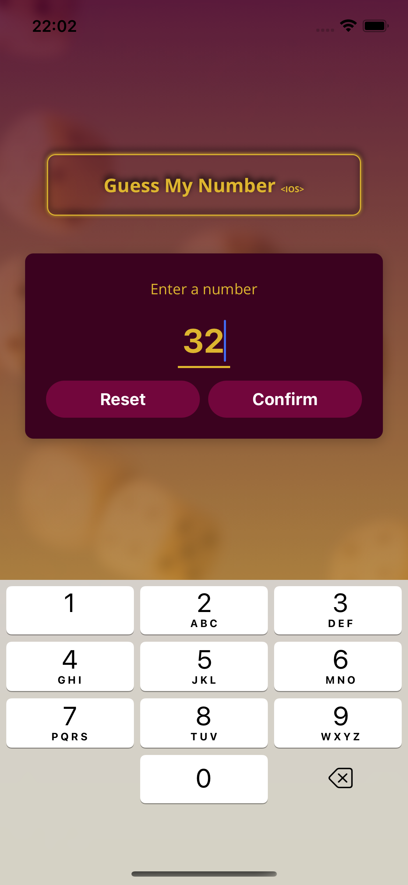
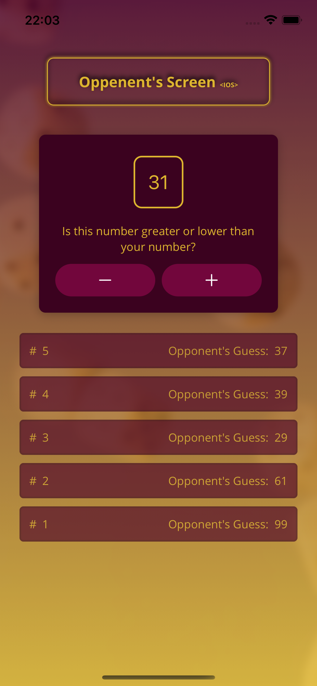
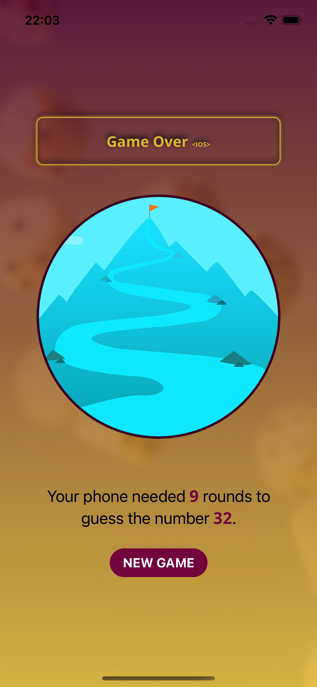

# Guess Number App

Welcome to the Guess Number App! This mobile application is designed to guess the number you have in mind through a series of interactive steps.

## How It Works

1. **Think of a Number**: Start by thinking of a number between 1 and 100.
2. **Interactive Guessing**: The app will make a guess, and you will interact with the `+` and `-` buttons to indicate whether your number is higher or lower than the app's guess.
3. **Refinement**: The app will refine its guesses based on your inputs until it correctly identifies your number.

## Features

- **User-Friendly Interface**: Simple and intuitive design for easy interaction.
- **Efficient Algorithm**: Quickly narrows down the possible numbers to guess your number accurately.
- **Visual Feedback**: Provides immediate feedback on each guess with the `+` and `-` buttons.

## Screenshots

Here are some screenshots of the app in action:


|  |  |  |
|---------------------------------------|---------------------------------------|---------------------------------------|


## Installation

To install the Guess Number App, follow these steps:

```sh
$ npm install
$ npm start

# test it on iOS or android simulator
```
